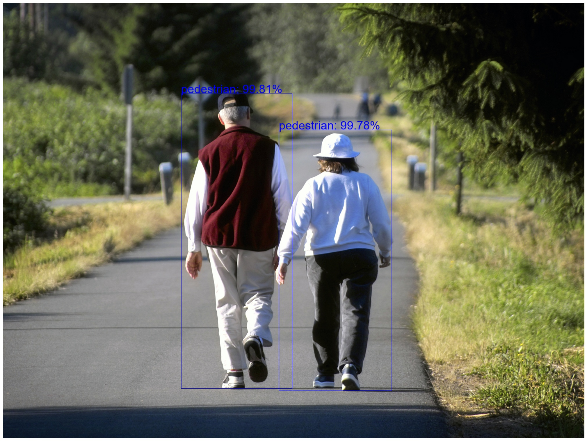

### Reimplement Object Detection with MaskRCNN (MobilenetV2)

dataset: https://www.cis.upenn.edu/~jshi/ped_html/

### Usage:
```sh
$ (root)
$ python ./ObjectDetection/main.py
$ python ./ObjectDetection/inference.py --imagepath \
            ./data/walking_people.jpg \
            --modelpath ./ObjectDetection/final_model.bin \
            --savepath ./ObjectDetection/result.jpg
```



### References:

https://pytorch.org/tutorials/intermediate/torchvision_tutorial.html#